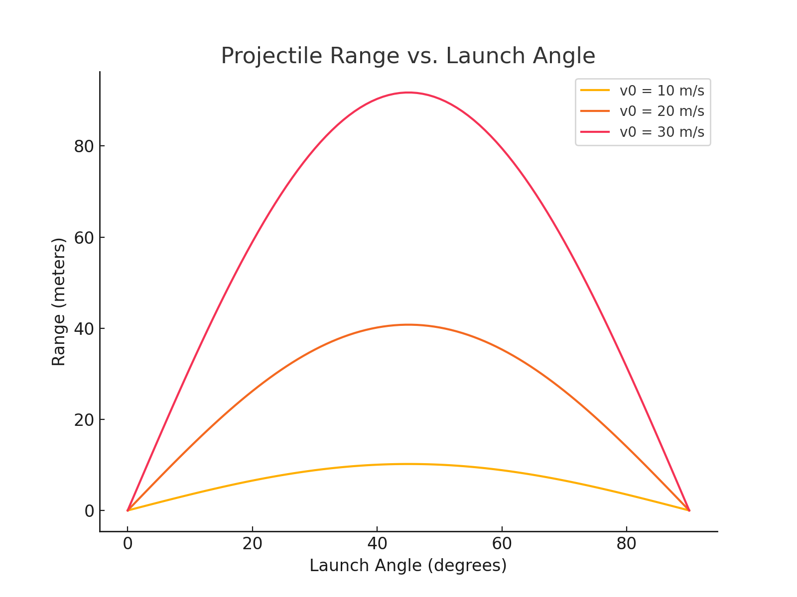

# Problem 1

## Introduction
Projectile motion is a fundamental concept in mechanics. In this problem, we analyze how the **range** of a projectile depends on the **angle of projection**. 

## Governing Equation
The range $R$ of a projectile launched with an initial velocity $v_0$ at an angle $θ$ (with respect to the horizontal) is given by:

$$
R = \frac{v_0^2 \sin(2\theta)}{g}
$$

where:

- $v_0$ is the initial velocity (m/s),
- $θ$ is the launch angle (degrees),
- $g$  is the acceleration due to gravity (m/s²).

---

## **Python Implementation**

```python
import numpy as np
import matplotlib.pyplot as plt

def projectile_range(v0, theta, g=9.81):
    """
    Computes the range of a projectile given initial velocity and launch angle.
    :param v0: Initial velocity (m/s)
    :param theta: Launch angle (degrees)
    :param g: Acceleration due to gravity (m/s^2), default is Earth's gravity
    :return: Range of the projectile (meters)
    """
    theta_rad = np.radians(theta)  # Convert angle to radians
    return (v0**2 * np.sin(2 * theta_rad)) / g

# Simulation parameters
angles = np.linspace(0, 90, 100)  # Angles from 0 to 90 degrees
initial_velocities = [10, 20, 30]  # Different initial velocities

g = 9.81  # Gravity (m/s^2)

# Plot range vs. angle for different velocities
plt.figure(figsize=(8, 6))
for v0 in initial_velocities:
    ranges = [projectile_range(v0, theta, g) for theta in angles]
    plt.plot(angles, ranges, label=f'v0 = {v0} m/s')

plt.xlabel('Launch Angle (degrees)')
plt.ylabel('Range (meters)')
plt.title('Projectile Range as a Function of Launch Angle')
plt.legend()
plt.grid()
plt.show()
```

---

## **Observations**
- The maximum range occurs at **45°**.
- The same range is achieved for two complementary angles (e.g., $30°$ and $60°$).
- Increasing **initial velocity** increases the range.
- Increasing **gravity** decreases the range.


## **Further Exploration**
Future studies and simulations could consider:
- 🌍 **Air Resistance:** The influence of drag on real-world motion.
- 🏔️ **Uneven Terrain:** Effects of launching from different heights.
- 🌕 **Gravity Variations:** Comparing motion on the **Moon, Earth, and Mars**.


