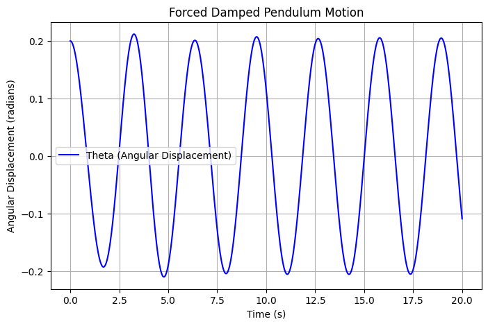

# Problem 2
# Investigating the Dynamics of a Forced Damped Pendulum

## 📌 Introduction
The **forced damped pendulum** is a fundamental system in physics and engineering that demonstrates a transition from **simple harmonic motion** to **resonance and chaos** due to the interplay of damping, restoring forces, and external periodic forcing. This study helps us understand complex real-world applications, including **energy harvesting, vibration isolation, and mechanical resonance.**


## 🧑‍🏫 **1. Theoretical Foundation**

### 🔹 Governing Equation
The motion of a **forced damped pendulum** is described by the following **differential equation**:

$$
\frac{d^2\theta}{dt^2} + b\frac{d\theta}{dt} + \frac{g}{L} \sin(\theta) = A \cos(\omega t)
$$

where:

- **$θ$** → Angular displacement (radians)

- **$b$** → Damping coefficient (controls energy loss)

- **$g$** → Gravitational acceleration

- **$L$** → Length of the pendulum

- **$A$** → Amplitude of the external driving force

- **$Ω$** → Frequency of the external force

### 🔹 Small-Angle Approximation
For **small oscillations**, we approximate **$\sin\theta \approx \theta$**, simplifying the equation to:

$$
\frac{d^2\theta}{dt^2} + b\frac{d\theta}{dt} + \frac{g}{L} \theta = A \cos(\omega t)
$$

This is a **linear equation**, and its solution describes **harmonic oscillations**.

### 🔹 Resonance Conditions
- When the driving frequency **$Ω$** matches the system's natural frequency:
  $$
  \omega_0 = \sqrt{\frac{g}{L}}
  $$
  resonance occurs, leading to **maximum oscillations**.

- At high amplitudes, the system can enter **chaotic motion**.


## 🔬 **2. Analysis of Dynamics**

### 🔹 Key Parameters Affecting Motion
1. **Damping coefficient $b$**: Higher damping reduces oscillations and suppresses chaos.

2. **Driving force amplitude $A$**: Large values introduce nonlinear behavior and chaos.

3. **Driving frequency $Ω$**: Affects resonance and synchronization.

### 🔹 Regular vs. Chaotic Motion

- **Low damping & weak forcing** → **Periodic oscillations** (predictable motion).

- **Moderate forcing** → **Resonance** (large oscillations at specific frequencies).

- **High forcing & nonlinearity** → **Chaos** (unpredictable motion with extreme sensitivity to initial conditions).


## 🌍 **3. Real-World Applications**
### Common Uses of Forced Damped Pendulums

- **🏗️ Suspension Bridges** → Studying oscillations in structures.

- **🔋 Energy Harvesting** → Using vibrations to generate electricity.

- **⚡ Oscillating Circuits** → Analogous to driven **RLC circuits**.

### **Real-World Example: A Playground Swing**

A **swing** acts as a forced damped pendulum:

- The child’s motion adds an **external periodic force**.

- If pushing is **in sync** with the swing’s natural frequency → **Resonance occurs** (higher amplitude).

- If air resistance & friction increase → **Damping reduces motion**.

- Random pushing at different times can lead to **chaotic motion**.


## 🖥️ **4. Computational Implementation**
We develop a **Python simulation** to:

- Numerically **solve the differential equation**.

- **Visualize** pendulum motion for different damping and forcing.

- Generate **phase diagrams** and **Poincaré sections** to illustrate chaotic transitions.

### 🔹 **Python Script**
```python
import numpy as np
import matplotlib.pyplot as plt
from scipy.integrate import solve_ivp

# Define the forced damped pendulum equation
def forced_damped_pendulum(t, y, b, g, L, A, omega):
    theta, omega_dot = y
    dtheta_dt = omega_dot
    domega_dt = -b * omega_dot - (g / L) * np.sin(theta) + A * np.cos(omega * t)
    return [dtheta_dt, domega_dt]

# Parameters
b = 0.5        # Damping coefficient
g = 9.81       # Gravity (m/s^2)
L = 1.0        # Length of the pendulum (m)
A = 1.2        # Driving force amplitude
omega_drive = 2.0  # Driving frequency

# Initial conditions
theta_0 = 0.2  # Initial angle (radians)
omega_0 = 0.0  # Initial angular velocity

# Time span
t_span = (0, 20)  # Simulate for 20 seconds
t_eval = np.linspace(*t_span, 1000)

# Solve the equation
sol = solve_ivp(forced_damped_pendulum, t_span, [theta_0, omega_0], t_eval=t_eval, args=(b, g, L, A, omega_drive))

# Plot results
plt.figure(figsize=(8, 5))
plt.plot(sol.t, sol.y[0], label='Theta (Angular Displacement)', color='b')
plt.xlabel('Time (s)')
plt.ylabel('Angular Displacement (radians)')
plt.title('Forced Damped Pendulum Motion')
plt.legend()
plt.grid()

plt.show()
```



This graph shows how the angular displacement of the pendulum changes over time under damping and periodic forcing.

### Expected Additional Plots:

- **Phase portraits** to visualize stability and chaos.

- **Bifurcation diagrams** to show changes in periodicity.


## 📌 **Conclusion**
The forced damped pendulum is a rich model for exploring **chaotic dynamics, resonance, and real-world oscillations**. By analyzing its behavior, we gain insights into **engineering, physics, and even biological rhythms**.


