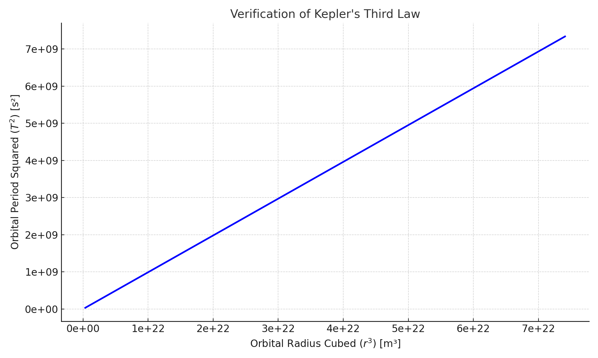

# Problem 1

# Kepler's Third Law: Orbital Period and Radius

> "The harmony of the world is made manifest in the laws of nature." – Kepler

## What Are We Exploring?

We aim to understand how a planet or satellite’s **orbital period** (how long it takes to complete an orbit) is related to its **distance from the central body**.

This brings us to **Kepler’s Third Law**:

$$
T^2 \propto r^3
$$

Where:

- $T$ = Orbital period

- $r$ = Orbital radius

## The Physics Behind It

We start from two fundamental physics principles:

- Newton’s Law of Gravitation:
  $$
  F = \frac{G M m}{r^2}
$$

- Centripetal force needed to keep an object in circular motion:
  $$
  F = \frac{m v^2}{r}
  $$

Setting them equal, and working through the math (see full derivation in notebook), we arrive at:

$$
T^2 = \frac{4\pi^2}{GM} r^3
$$

This shows that for **circular orbits**, the square of the orbital period is proportional to the cube of the radius.

## Real-World Example: The Moon & Earth

By measuring:

- $T$ (orbital period ≈ 27.3 days)

- $r$ (distance from Earth to Moon ≈ 384,400 km)

we can apply Kepler’s Law to calculate **Earth’s mass — or vice versa**, confirm these values based on known mass.

## Visual Verification

We ran a Python simulation to compute and plot $T^2$ and $r^3$ values for circular orbits around Earth.

Below is the graph showing this relationship:

As expected, the relationship is **linear**, confirming Kepler's Third Law in action.

## Why Does This Matter?

- Helps **design satellite orbits** (e.g., GPS, Starlink)

- Enables **planetary exploration** by predicting orbital paths

- Essential for **calculating masses** of planets and stars

##  What About Elliptical Orbits?

Kepler’s Law also applies to **elliptical orbits**, with a small change:

$$
T^2 \propto a^3
$$

Where $a$ is the **semi-major axis** of the ellipse.

##  Summary

- We derived Kepler’s Third Law from basic physics.
- We verified it through Python simulation.
- We explored how it's used in astronomy and satellite science.

