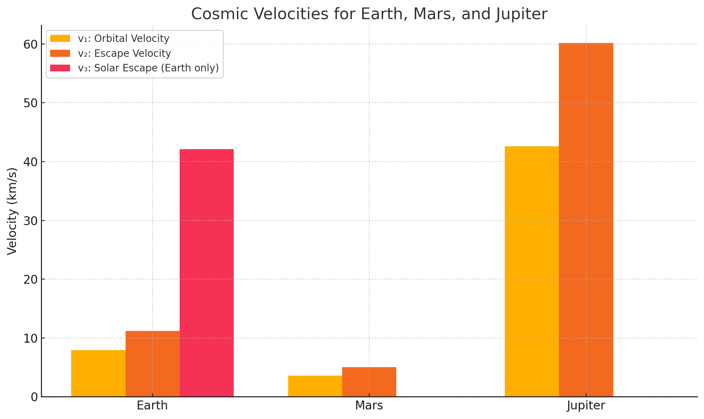
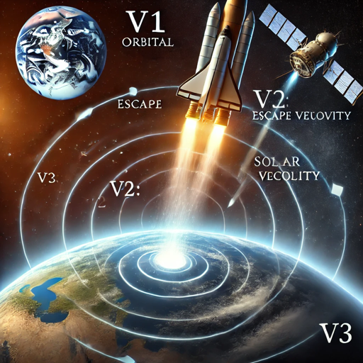

# Problem 2

# 🚀 Escape Velocities and Cosmic Velocities

> “The Earth is the cradle of humanity, but one cannot remain in the cradle forever.” – Konstantin Tsiolkovsky

## 🧭 Overview

Cosmic velocities define the speeds needed for different types of motion under a planet’s gravitational pull. These thresholds are fundamental to **space exploration**, from placing satellites in orbit to launching probes into interstellar space.

## ⚙️ Definitions of Cosmic Velocities

### 1️⃣ First Cosmic Velocity (Orbital Velocity)
- The **minimum speed required** to stay in a stable circular orbit just above a planet’s surface.
$$
v_1 = \sqrt{\frac{G M}{r}}
$$

### 2️⃣ Second Cosmic Velocity (Escape Velocity)
- The **minimum speed required to completely escape** the gravitational field of a planet without further propulsion.
$$
v_2 = \sqrt{2} \cdot v_1 = \sqrt{\frac{2 G M}{r}}
$$

### 3️⃣ Third Cosmic Velocity (Solar Escape Velocity)
- The speed needed to **escape the gravitational pull of the Sun** from Earth’s surface.
- This includes Earth’s orbital motion and the Sun’s gravitational field.
- Approximate value:  
$$
v_3 \approx 42.1 \text{ km/s (from Earth)}
$$

## 📐 Parameters and Equations

To compute these velocities, we use the following parameters:

| Planet   | Mass (kg)        | Radius (m)     |
|----------|------------------|----------------|
| Earth    | $5.972 \times 10^{24}$ | $6.371 \times 10^6$ |
| Mars     | $6.417 \times 10^{23}$ | $3.3895 \times 10^6$ |
| Jupiter  | $1.898 \times 10^{27}$ | $6.9911 \times 10^7$ |

## 📊 Visual Comparison of Velocities

The following chart shows the **first, second, and third cosmic velocities** for Earth, Mars, and Jupiter. For solar escape (v₃), only Earth is shown.

## 🌌 Real-World Applications

| Mission Type | Required Velocity |
|--------------|-------------------|
| Placing a satellite in orbit | $v_1$ |
| Sending a spacecraft to the Moon or Mars | $v_2$ |
| Voyager, New Horizons, Interstellar missions | $v_3$ |

### Applying Cosmic Velocities

This image illustrates **how different cosmic velocities apply in real-world space missions**:

- A **rocket launching from Earth** must first reach **orbital velocity (v₁)** to stay in space.
- To break free from Earth’s gravity, it must accelerate to **escape velocity (v₂)**.
- To leave the **Solar System**, like the **Voyager missions**, it must achieve the **third cosmic velocity (v₃)**.

Each motion path—shown by arrows in the image—represents a different mission objective, demonstrating the increasing challenge of leaving Earth, then the Solar System.

## 🧠 Conclusion

- **First cosmic velocity** lets you orbit.

- **Second cosmic velocity** lets you escape.

- **Third cosmic velocity** lets you leave the Solar System.

These values are not just theoretical—they define the thresholds every rocket must overcome in real missions.

