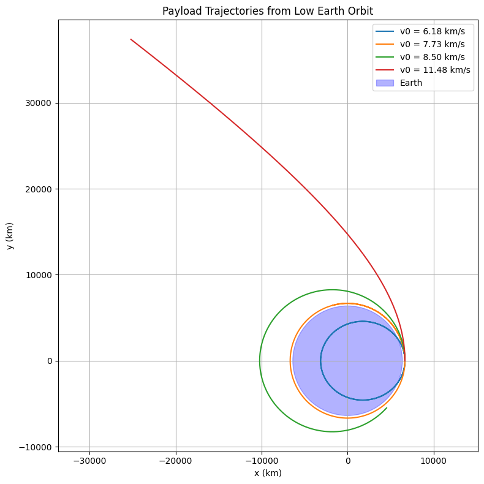

# Problem 3

# Trajectories of a Freely Released Payload Near Earth

## 🌍 Motivation
When an object (payload) is released from a rocket near Earth, it enters a new gravitational context depending on its velocity, position, and direction. This scenario helps us explore the principles of **orbital mechanics**, **gravitational physics**, and **space mission dynamics**.

## 🧠 Theoretical Background

### Newton's Law of Gravitation
The force acting on the payload due to Earth's gravity is:
$$
\vec{F} = -\frac{G M m}{r^2} \hat{r}
$$

Where:
- $G$ is the gravitational constant

- $M$ is Earth’s mass

- $m$ is the payload’s mass

- $r$ is the distance from Earth's center

- $\hat{r}$ is the unit vector pointing 
from the payload to the Earth’s center

This force produces an acceleration:
$$
\vec{a} = -\frac{G M}{r^2} \hat{r}
$$

### Orbital Energy and Trajectory Types
The total mechanical energy $E$ of the payload determines the type of trajectory:
- $E < 0$: Elliptical orbit (bound)

- $E = 0$: Parabolic trajectory (escape edge)
- $E > 0$: Hyperbolic trajectory (escape)

### Key Velocities
- **Orbital velocity**: $$v = \sqrt{\frac{G M}{r}}$$

- **Escape velocity**: $$v = \sqrt{\frac{2 G M}{r}}$$


## 📊 Simulation in Python
Below is a Python implementation that simulates the motion of a payload released from low Earth orbit with various initial speeds.

### 🧮 Python Code
```python
import numpy as np
import matplotlib.pyplot as plt
from scipy.integrate import solve_ivp

# Constants
G = 6.67430e-11  # gravitational constant (m^3/kg/s^2)
M = 5.972e24     # mass of Earth (kg)
R_earth = 6.371e6  # radius of Earth (m)

# Gravitational acceleration function
def gravity(t, y):
    x, y_, vx, vy = y
    r = np.sqrt(x**2 + y_**2)
    ax = -G * M * x / r**3
    ay = -G * M * y_ / r**3
    return [vx, vy, ax, ay]

# Initial conditions for different velocities
altitude = 300e3  # 300 km above Earth surface
r0 = R_earth + altitude
angles = [0, 30, 45, 60]  # degrees

# Choose initial speeds
v_orbit = np.sqrt(G * M / r0)        # orbital
v_escape = np.sqrt(2 * G * M / r0)    # escape
velocities = [0.8 * v_orbit, v_orbit, 1.1 * v_orbit, v_escape * 1.05]

# Time span
t_span = (0, 7000)
t_eval = np.linspace(*t_span, 1000)

# Plot setup
plt.figure(figsize=(8, 8))

for v0 in velocities:
    y0 = [r0, 0, 0, v0]  # launch from (r0, 0) with velocity in y direction
    sol = solve_ivp(gravity, t_span, y0, t_eval=t_eval, rtol=1e-8)
    plt.plot(sol.y[0] / 1e3, sol.y[1] / 1e3, label=f'v0 = {v0/1e3:.2f} km/s')

# Earth
circle = plt.Circle((0, 0), R_earth / 1e3, color='blue', alpha=0.3, label='Earth')
plt.gca().add_artist(circle)

plt.xlabel('x (km)')
plt.ylabel('y (km)')
plt.title('Payload Trajectories from Low Earth Orbit')
plt.axis('equal')
plt.grid(True)
plt.legend()
plt.tight_layout()
plt.show()
```



## 🚀 Trajectory Types Observed
- **Sub-orbital fall** (if initial speed is too low)

- **Circular/Elliptical orbit** (if speed ≈ orbital speed)

- **Escape** (if speed > escape velocity)

- **Hyperbolic** (if speed greatly exceeds escape velocity)


## 🛰️ Real-World Applications
- **Satellite deployment**: Requires precision in velocity to maintain orbit

- **Reentry capsules**: Released to descend back to Earth

- **Interplanetary missions**: Require escape trajectory from Earth and then Sun


## 📌 Conclusion
By changing the **initial speed and angle**, the payload’s trajectory dramatically shifts. Numerical simulations provide deep insights into how small changes affect mission success—from stable orbits to deep space escape.

This analysis and tool are fundamental in planning any real-world space deployment or return mission.

