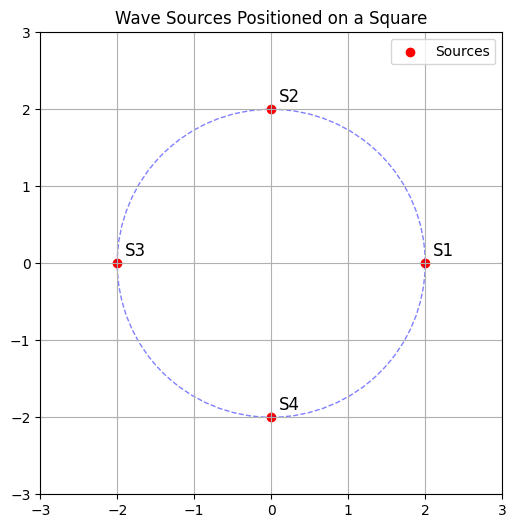
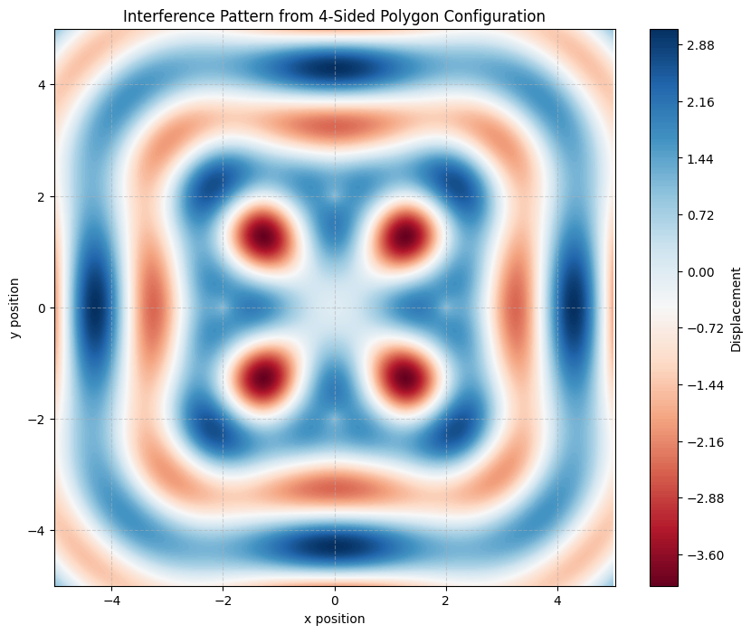

# Problem 1
# Interference Patterns on a Water Surface

## Introduction
This report focuses on the interference of surface water waves originating from multiple coherent point sources. These sources are placed at the vertices of a regular polygon, ensuring symmetrical spacing and uniform conditions for wave propagation. 

The primary objective is to analyze how the superposition of such waves forms complex interference patterns, and to understand the role of geometrical arrangements and wave parameters in shaping these patterns.

The simulation is developed in Python using numerical techniques and graphical visualization. By plotting the resultant displacement of the water surface, we can clearly distinguish between areas of constructive and destructive interference and study their symmetry.

### Geometrical Configuration of Sources

```python
import matplotlib.pyplot as plt
import numpy as np

n_sources = 4
radius = 2
angles = np.linspace(0, 2*np.pi, n_sources, endpoint=False)
x_coords = radius * np.cos(angles)
y_coords = radius * np.sin(angles)

fig, ax = plt.subplots(figsize=(6,6))
ax.scatter(x_coords, y_coords, color='red', label='Sources')
for i, (x, y) in enumerate(zip(x_coords, y_coords)):
    ax.text(x + 0.1, y + 0.1, f"S{i+1}", fontsize=12)

circle = plt.Circle((0, 0), radius, color='blue', fill=False, linestyle='--', alpha=0.5)
ax.add_patch(circle)
ax.set_xlim(-3, 3)
ax.set_ylim(-3, 3)
ax.set_aspect('equal')
ax.grid(True)
ax.legend()
plt.title('Wave Sources Positioned on a Square')
plt.show()
```


- All sources are coherent and monochromatic (same wavelength, frequency, and amplitude).

- Waves propagate as circular wavefronts from each source.

- The water surface displacement is calculated using the principle of linear superposition.

- Simulation is conducted in 2D space on a uniform grid.

## Mathematical Background
The displacement $u\vec{r}$, t at position $\vec{r}$ and time $t$ due to a single wave source at position $\vec{r}_0$ is given by:

$$u(\vec{r}, t) = A \sin(k|\vec{r} - \vec{r}_0| - \omega t + \phi)$$

Where:
- $A$: Amplitude of the wave

- $k = \frac{2\pi}{\lambda}$: Wave number, $\lambda$ is the wavelength

- $\omega = 2\pi f$: Angular frequency, $f$ is the frequency

- $\phi$: Initial phase

- $|\vec{r} - \vec{r}_0|$: Distance from the source to point $\vec{r}$

The total displacement from multiple sources is:

$$u_{total}(\vec{r}, t) = \sum_{i=1}^{N} A \sin(k|\vec{r} - \vec{r}_i| - \omega t + \phi)$$

Where $N$ is the number of sources.

## Implementation in Python

### Imports
```python
import numpy as np
import matplotlib.pyplot as plt
```

### Parameters
```python
A = 1.0                # Amplitude
wavelength = 2.0       # Wavelength (lambda)
k = 2 * np.pi / wavelength  # Wave number
f = 1.0                # Frequency
omega = 2 * np.pi * f      # Angular frequency
phi = 0.0              # Initial phase
```

### Simulation Grid
```python
x = np.linspace(-5, 5, 500)
y = np.linspace(-5, 5, 500)
X, Y = np.meshgrid(x, y)
t = 0  # Time snapshot (can vary this for animation)
```

### Polygon Source Placement
```python
n_sources = 4  # Change to 3, 5, etc. for other polygons
radius = 2.0  # Distance from center to each source
angles = np.linspace(0, 2 * np.pi, n_sources, endpoint=False)
sources = [(radius * np.cos(a), radius * np.sin(a)) for a in angles]
```

### Superposition of Waves
```python
Z_total = np.zeros_like(X)
for (x0, y0) in sources:
    r = np.sqrt((X - x0)**2 + (Y - y0)**2)
    Z = A * np.sin(k * r - omega * t + phi)
    Z_total += Z
```

### Visualization of Interference Pattern
```python
plt.figure(figsize=(10, 8))
plt.contourf(X, Y, Z_total, levels=200, cmap='RdBu')
plt.colorbar(label='Displacement')
plt.title(f'Interference Pattern from {n_sources}-Sided Polygon Configuration')
plt.xlabel('x position')
plt.ylabel('y position')
plt.axis('equal')
plt.grid(True, linestyle='--', alpha=0.5)
plt.show()
```



## Observations and Analysis
The resulting interference pattern, derived from the superposition of waves emitted at regular polygon vertices, reveals several significant physical phenomena:

### Constructive Interference
Constructive interference occurs at points where the wavefronts from multiple sources arrive in phase. This means the path length differences between sources correspond to integer multiples of the wavelength. In the visualization, these points manifest as high-displacement fringes. For a square configuration, these fringes exhibit square symmetry, with pronounced periodicity along diagonals and sides.

### Destructive Interference
Destructive interference emerges where wavefronts arrive out of phase (typically by half a wavelength). This leads to cancellation of displacement, and such areas are represented by low or nearly zero values in the plot. These points often lie between the maxima and form nodal lines or regions, creating the characteristic ripple effects seen in the interference map.

### Symmetry of the Pattern
The symmetry of the polygonal configuration plays a crucial role in shaping the pattern. A square arrangement yields a pattern with fourfold rotational symmetry and reflectional symmetry along its diagonals and axes. If the number of sources changes (e.g., using a triangle or pentagon), the symmetry and spacing of the interference fringes would also change correspondingly.

### Fringe Spacing and Wavelength Relationship
The density of interference fringes is inversely proportional to the wavelength. A shorter wavelength results in more closely spaced fringes, increasing the resolution and complexity of the pattern. In this simulation, the chosen wavelength balances clarity with computational feasibility.

### Interpretation of the Color Map
The color map in the visualization represents instantaneous displacement of the water surface. Red and blue regions denote opposite displacement polarities (peaks and troughs), while intermediate colors indicate zero-crossings or regions of destructive interference. The clear, periodic alternation between high and low displacement illustrates the coherent and stable nature of the wave sources.

### Influence of Source Radius
The radius of the polygon (i.e., the distance from the origin to each source) determines the overall scale of the interference structure. A larger radius spreads the sources farther apart, potentially increasing the central region’s complexity. Conversely, a smaller radius condenses the interference features near the center.

Overall, the analysis shows that the resulting interference pattern is a rich function of geometry, wavelength, and wave coherence. These findings are fundamental in fields like optics, acoustics, and fluid dynamics.
- Animate the wave pattern over time by varying `t`

- Use other polygons (triangle, pentagon, hexagon) and compare their patterns

- Change phase differences between sources for more complex interactions

- Add damping or nonlinear effects for more realism

## Conclusion
This simulation effectively visualizes how waves from multiple sources interact on a water surface. By leveraging symmetry and wave superposition, we gain a clearer understanding of the principles of interference and the beauty of wave physics in two dimensions.
