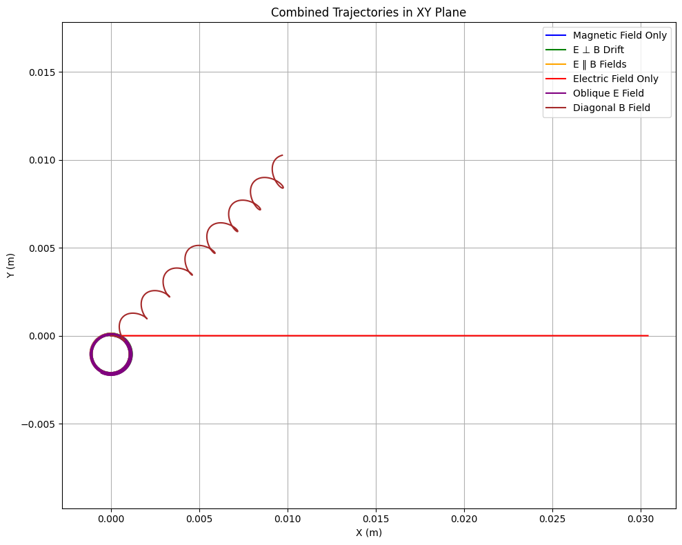

# Lorentz Force Simulation: Motion of Charged Particles in Electric and Magnetic Fields

## Introduction
The Lorentz force is the fundamental expression governing how charged particles move under the influence of electric and magnetic fields. It is given by:

$$\vec{F} = q (\vec{E} + \vec{v} \times \vec{B})$$

Where:

- $q$ is the charge of the particle

- $\vec{E}$ is the electric field vector

- $\vec{B}$ is the magnetic field vector

- $\vec{v}$ is the velocity vector of the particle

This simulation demonstrates how particle motion is affected in different field configurations using numerical integration methods.


## Applications of the Lorentz Force

- **Cyclotrons and Synchrotrons**: Particle accelerators use magnetic fields to bend and focus beams of charged particles.

- **Mass Spectrometry**: Ions are separated based on their mass-to-charge ratio using magnetic and electric fields.

- **Plasma Confinement**: Magnetic fields are used to trap and control high-temperature plasmas in fusion devices (e.g., tokamaks).

Electric fields accelerate charged particles, while magnetic fields bend their paths, causing circular or helical motion depending on the velocity vector.


## Complete Python Implementation
```python
import numpy as np
import matplotlib.pyplot as plt
from mpl_toolkits.mplot3d import Axes3D

# Physical constants
q = 1.6e-19         # Charge (Coulombs)
m = 1.67e-27        # Mass (kg) - using proton for better numerical stability      # Mass (kg)

# Choose one of the following cases:
# Case 1: Uniform magnetic field only
E = np.array([0.0, 0.0, 0.0])
B = np.array([0.0, 0.0, 1.0])

# Case 2: Crossed electric and magnetic fields (E ⊥ B)
# E = np.array([0.0, 100.0, 0.0])
# B = np.array([0.0, 0.0, 1.0])

# Case 3: Parallel E and B fields
# E = np.array([0.0, 0.0, 100.0])
# B = np.array([0.0, 0.0, 1.0])

# Case 4: Only electric field (electric field acceleration)
# E = np.array([100.0, 0.0, 0.0])
# B = np.array([0.0, 0.0, 0.0])

# Initial velocity and position
v0 = np.array([1e5, 0.0, 0.0])  # Velocity in m/s
r0 = np.array([0.0, 0.0, 0.0])  # Start at origin

dt = 1e-10
steps = 3000

# Lorentz force equation
def lorentz_force(q, E, B, v):
    return q * (E + np.cross(v, B))

# Motion simulation using Euler method
def simulate_motion(q, m, E, B, r0, v0, dt, steps):
    r = np.zeros((steps, 3))
    v = np.zeros((steps, 3))
    r[0] = r0
    v[0] = v0

    for i in range(1, steps):
        F = lorentz_force(q, E, B, v[i-1])
        a = F / m
        v[i] = v[i-1] + a * dt
        r[i] = r[i-1] + v[i] * dt

    return r, v

# Run the simulation
r, v = simulate_motion(q, m, E, B, r0, v0, dt, steps)

# Combined 2D Trajectories in One Plot

# Define field configurations to test (E, B, label, color)
cases = [
    (np.array([0.0, 0.0, 0.0]), np.array([0.0, 0.0, 1.0]), 'Magnetic Field Only', 'blue'),
    (np.array([0.0, 100.0, 0.0]), np.array([0.0, 0.0, 1.0]), 'E ⊥ B Drift', 'green'),
    (np.array([0.0, 0.0, 100.0]), np.array([0.0, 0.0, 1.0]), 'E ‖ B Fields', 'orange'),
    (np.array([100.0, 0.0, 0.0]), np.array([0.0, 0.0, 0.0]), 'Electric Field Only', 'red'),
    (np.array([50.0, 50.0, 0.0]), np.array([0.0, 0.0, 1.0]), 'Oblique E Field', 'purple'),
    (np.array([0.0, 0.0, 0.0]), np.array([1.0, 1.0, 1.0]), 'Diagonal B Field', 'brown')
]

plt.figure(figsize=(10, 8))
for E_test, B_test, label, color in cases:
    r_case, _ = simulate_motion(q, m, E_test, B_test, r0, v0, dt, steps)
    plt.plot(r_case[:, 0], r_case[:, 1], label=label, color=color)

plt.xlabel('X (m)')
plt.ylabel('Y (m)')
plt.title('Combined Trajectories in XY Plane')
plt.axis('equal')
plt.grid(True)
plt.legend()
plt.tight_layout()
plt.show()
```




## Analysis
The motion of a charged particle under the influence of electric and magnetic fields can vary significantly depending on the field configuration and the particle's initial velocity. This section breaks down key physical interpretations of the simulated motion, with accompanying visual examples to aid comprehension.

### 1. Uniform Magnetic Field (E = 0, B ≠ 0)
In this configuration, the particle experiences a centripetal Lorentz force perpendicular to both its velocity and the magnetic field. If the initial velocity is perpendicular to the magnetic field, the result is **circular motion**. If the initial velocity has components both perpendicular and parallel to the field, the particle follows a **helical path**.

```python
plt.figure(figsize=(6,6))
plt.plot(r[:,0], r[:,1])
plt.xlabel('x (m)')
plt.ylabel('y (m)')
plt.title('Top View: Circular/Helical Motion in Uniform Magnetic Field')
plt.axis('equal')
plt.grid(True)
plt.show()
```

### 2. Crossed Electric and Magnetic Fields (E ⊥ B)
When both E and B fields are present and perpendicular to each other, the charged particle undergoes a **drift motion**. The net motion combines the cyclotron motion with a linear drift in the direction of E × B. This is known as the **E × B drift**.

Drift velocity:

v_d = (E × B) / B²

Simulation parameters for $E × B$ drift:
```python
E = np.array([0, 1e3, 0])
B = np.array([0, 0, 1])
```
Expected result: a helical trajectory drifting in the x-direction.

### 3. Larmor Radius (Cyclotron Radius)
The Larmor radius, or gyroradius, defines the radius of circular motion in a magnetic field:

$$r_L = (m * v_perp) / (q * B)$$

It depends on the particle’s mass, charge, magnetic field strength, and the perpendicular velocity component. A larger mass or velocity leads to a wider spiral.

### 4. Energy Conservation
In a uniform magnetic field, the force is always perpendicular to the velocity, meaning the magnetic force does no work. Therefore, the **kinetic energy of the particle remains constant** throughout the motion.

### 5. Practical Example: Cyclotron
A cyclotron accelerates particles using a combination of electric fields (for acceleration) and magnetic fields (to bend the path into circles). The simulation mimics the forces acting on particles in such devices, illustrating circular or helical motion—fundamental to understanding particle dynamics in accelerators.


