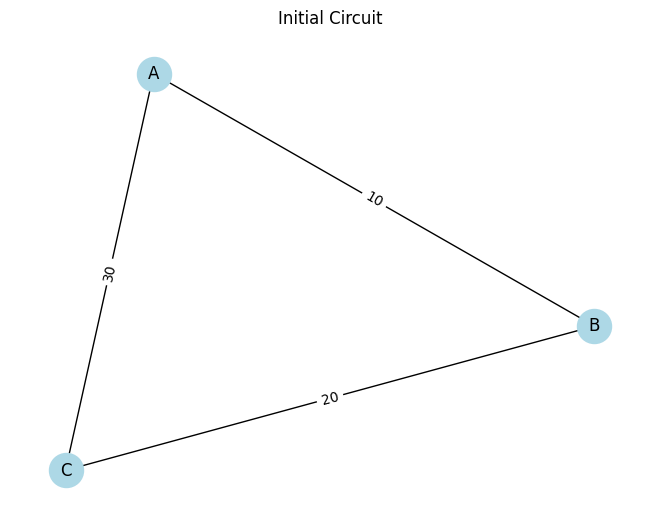

# Problem 1

# Equivalent Resistance Using Graph Theory

## Introduction
Determining the equivalent resistance between two points in a circuit is essential for understanding current flow and power distribution. While traditional series-parallel simplifications work for small circuits, complex or nested resistor networks are better handled using graph theory.

By modeling the circuit as a graph:

- **Nodes** represent electrical junctions.

- **Edges** represent resistors with weights equal to their resistance.


## Problem Setup

### Graph Representation of a Circuit

- Each junction in the circuit becomes a node.

- Each resistor becomes a weighted edge.

- The goal is to reduce the graph until only one edge remains between the source and target nodes.


## Pseudocode and Algorithm Description
### Series Reduction Rule

If a node has exactly two neighbors (degree 2) and is not the source/target:

- Replace it with a direct connection between its neighbors.

- Combine resistances by addition.

### Parallel Reduction Rule

If there are multiple edges between the same two nodes:

- Combine resistances using the formula:
  $$R_{eq} = ( \sum_{i} \frac{1}{R_i})^{-1}$$

### Pseudocode
```text
FUNCTION simplify_circuit(graph):
    WHILE graph is not fully reduced:
        FOR each node:
            IF degree == 2 and not terminal:
                replace with series resistor
        FOR node pairs with multiple edges:
            replace with single parallel resistor
    RETURN resistance between source and target
```


## Python Implementation

### Imports and Utilities
```python
import networkx as nx
import matplotlib.pyplot as plt

def combine_series(R1, R2):
    return R1 + R2

def combine_parallel(R1, R2):
    return 1 / (1 / R1 + 1 / R2)
```

### Visualization Function
```python
def draw_graph(G, title):
    pos = nx.spring_layout(G, seed=42)
    edge_labels = nx.get_edge_attributes(G, 'resistance')
    nx.draw(G, pos, with_labels=True, node_color='lightblue', node_size=600)
    nx.draw_networkx_edge_labels(G, pos, edge_labels=edge_labels)
    plt.title(title)
    plt.show()
```

### Simplification Algorithm
```python
def simplify_circuit(G, source, target):
    step = 1
    draw_graph(G, f"Step {step}: Initial Circuit")
    step += 1
    changed = True
    while changed:
        changed = False

        for node in list(G.nodes):
            if node not in [source, target] and G.degree(node) == 2:
                neighbors = list(G.neighbors(node))
                if len(neighbors) == 2 and not G.has_edge(neighbors[0], neighbors[1]):
                    r1 = G[neighbors[0]][node]['resistance']
                    r2 = G[neighbors[1]][node]['resistance']
                    combined = combine_series(r1, r2)
                    G.add_edge(neighbors[0], neighbors[1], resistance=combined)
                    G.remove_node(node)
                    changed = True
                    draw_graph(G, f"Step {step}: After series simplification at {node}")
                    step += 1
                    break

        edge_counts = {}
        for u, v in list(G.edges):
            key = tuple(sorted([u, v]))
            edge_counts.setdefault(key, []).append(G[u][v]['resistance'])

        for (u, v), resistances in edge_counts.items():
            if len(resistances) > 1:
                req = resistances[0]
                for r in resistances[1:]:
                    req = combine_parallel(req, r)
                G.remove_edges_from([(u, v)] * len(resistances))
                G.add_edge(u, v, resistance=req)
                changed = True
                draw_graph(G, f"Step {step}: After parallel simplification between {u}-{v}")
                step += 1
                break

    return G
```

### Test Circuit Example
```python
G = nx.Graph()
G.add_edge('A', 'B', resistance=10)
G.add_edge('B', 'C', resistance=20)
G.add_edge('A', 'C', resistance=30)

simplified = simplify_circuit(G, 'A', 'C')
print("Final Equivalent Resistance between A and C:", simplified['A']['C']['resistance'])
```


## Analysis and Use Cases

- Works well for resistive-only circuits.

- Scales better than manual methods for medium-complexity problems.

- Can be adapted for educational circuit solvers, PCB validation tools, and simulation engines.
