# Problem 1
#  Exploring the Central Limit Theorem through Simulations

##  Motivation

The **Central Limit Theorem (CLT)** is a foundational principle in probability and statistics. It states that the **sampling distribution of the sample mean** becomes approximately normal as the sample size increases, **regardless of the original population distribution**—provided the samples are independent and identically distributed.

This property is essential for statistical inference and underpins many techniques in hypothesis testing, confidence intervals, and quality control.

In this project, we explore the CLT through hands-on simulations using Python.

## Mathematical Expression of the CLT

Let $X_1, X_2, \ldots, X_n$ be a random sample of size $n$ drawn from a population with:

- Mean $\mu$

- Standard deviation $\sigma$

Then the **sampling distribution of the sample mean** $\bar{X}$ approaches a **normal distribution** as $n \to \infty$:

$$
\bar{X} = \frac{1}{n} \sum_{i=1}^{n} X_i \xrightarrow{d} \mathcal{N}\left(\mu, \frac{\sigma^2}{n}\right)
$$

This means:

- The **mean** of the sampling distribution is $\mu$

- The **variance** is $\frac{\sigma^2}{n}$

- The **standard deviation** (called the standard error) is $\frac{\sigma}{\sqrt{n}}$


## Simulation Setup

We investigate the CLT using the following population distributions:

-  **Uniform Distribution**: All values within a range are equally likely.

- **Exponential Distribution**: A skewed distribution modeling time between events.

- **Binomial Distribution**: Discrete distribution representing success/failure outcomes.

### Libraries and Configuration

```python
import numpy as np
import matplotlib.pyplot as plt
import seaborn as sns

# Plot styling
sns.set(style="whitegrid")
np.random.seed(42)

# Configuration
population_size = 100_000
sample_sizes = [5, 10, 30, 50]
num_samples = 1000
```


## Uniform Distribution

### Population Overview

```python
# Generate uniform distribution
uniform_population = np.random.uniform(low=0, high=10, size=population_size)

# Plot population
sns.histplot(uniform_population, bins=50, kde=True)
plt.title("Uniform Population Distribution")
plt.xlabel("Value")
plt.ylabel("Frequency")
plt.show()
```
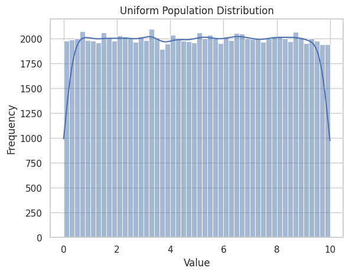

### Sampling Distributions

```python
for n in sample_sizes:
    means = [np.mean(np.random.choice(uniform_population, size=n)) for _ in range(num_samples)]
    sns.histplot(means, bins=30, kde=True)
    plt.title(f"Sample Means (Uniform, n={n})")
    plt.xlabel("Sample Mean")
    plt.ylabel("Frequency")
    plt.show()
```
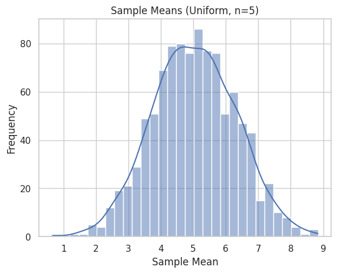

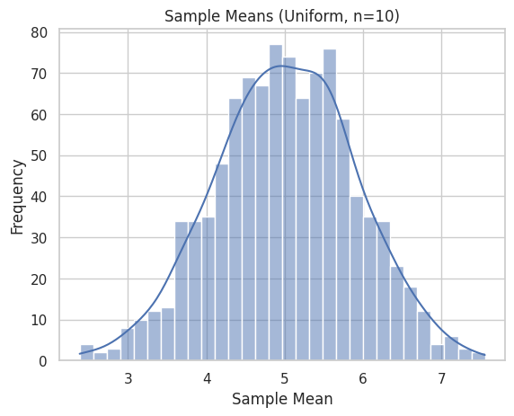

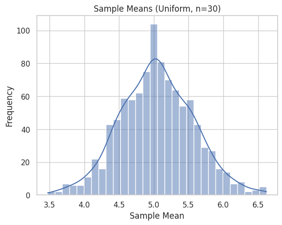

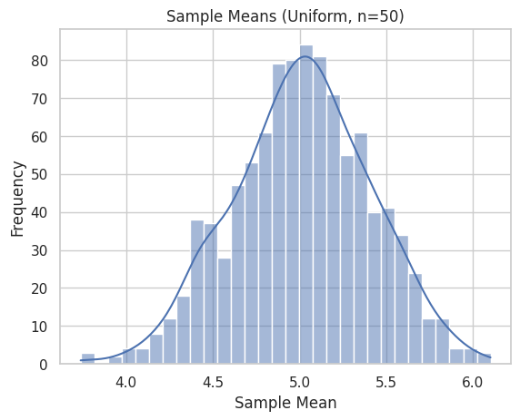


##  Exponential Distribution

### Population Overview

```python
# Generate exponential distribution
exponential_population = np.random.exponential(scale=1.0, size=population_size)

sns.histplot(exponential_population, bins=50, kde=True)
plt.title("Exponential Population Distribution")
plt.xlabel("Value")
plt.ylabel("Frequency")
plt.show()
```
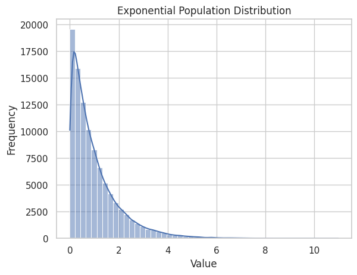

### Sampling Distributions

```python
for n in sample_sizes:
    means = [np.mean(np.random.choice(exponential_population, size=n)) for _ in range(num_samples)]
    sns.histplot(means, bins=30, kde=True)
    plt.title(f"Sample Means (Exponential, n={n})")
    plt.xlabel("Sample Mean")
    plt.ylabel("Frequency")
    plt.show()
```
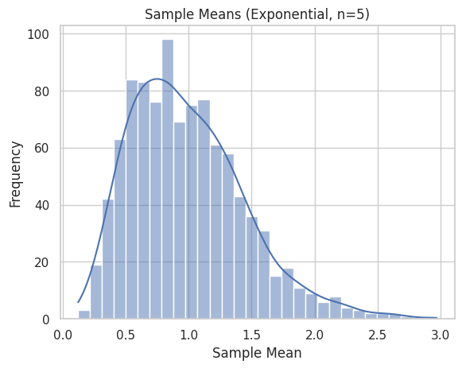

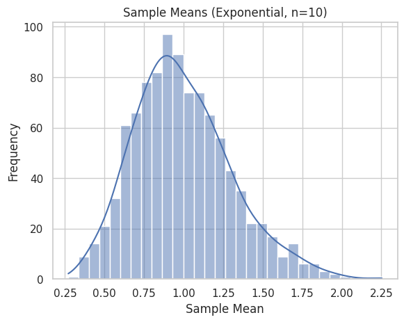

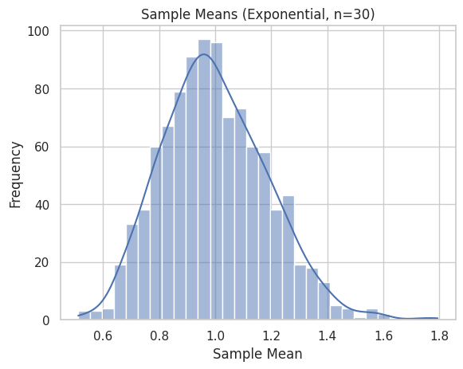

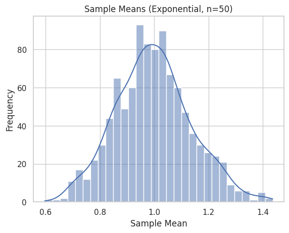


## Binomial Distribution

### Population Overview

```python
# Generate binomial distribution
binomial_population = np.random.binomial(n=10, p=0.5, size=population_size)

sns.histplot(binomial_population, bins=11)
plt.title("Binomial Population Distribution")
plt.xlabel("Value")
plt.ylabel("Frequency")
plt.show()
```
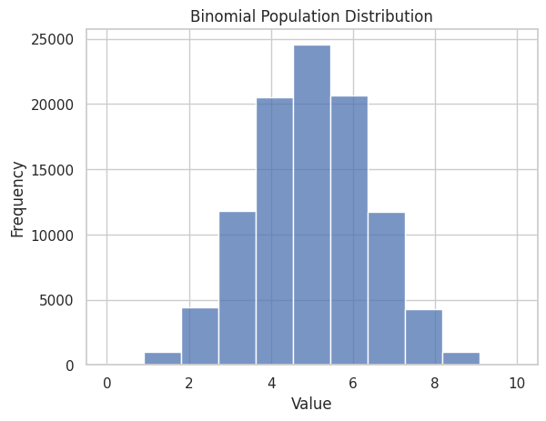

### Sampling Distributions

```python
for n in sample_sizes:
    means = [np.mean(np.random.choice(binomial_population, size=n)) for _ in range(num_samples)]
    sns.histplot(means, bins=30, kde=True)
    plt.title(f"Sample Means (Binomial, n={n})")
    plt.xlabel("Sample Mean")
    plt.ylabel("Frequency")
    plt.show()
```
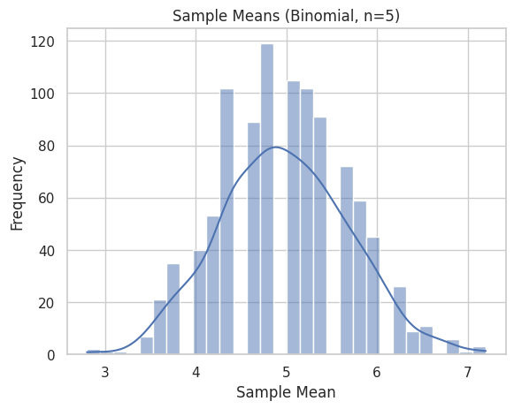

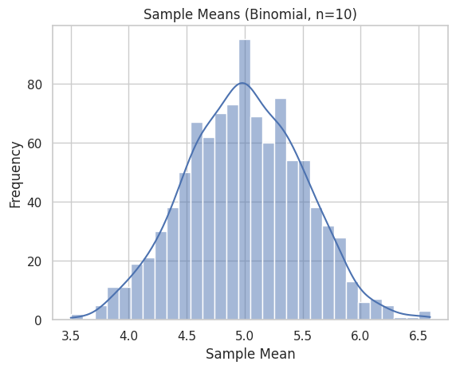

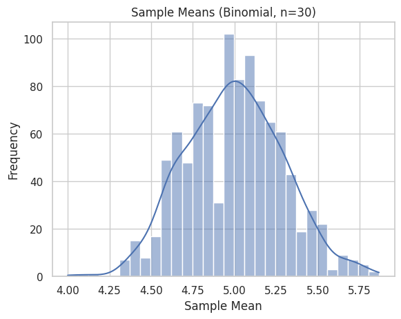

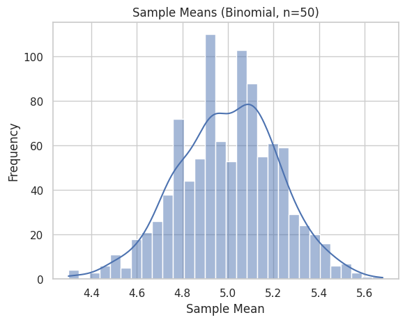
## Observations

- As the **sample size increases**, the sampling distribution of the mean **approaches a normal shape**.

- This convergence occurs **regardless of the population distribution**:

  - For skewed distributions like exponential, larger sample sizes are needed.

  - For symmetric distributions like uniform or binomial, convergence is faster.

- The **spread (standard deviation)** of the sampling distribution **decreases with larger samples**.


## Real-World Applications

The CLT is used in:

-  **Estimating population parameters** when the population distribution is unknown.

- **Quality control** in industrial settings using sample-based inspections.

-  **Finance** for modeling average returns and risks.

- **Scientific research** where sample statistics are used for inference.


##  Tools and Technologies

- **NumPy**: Random data generation and statistical operations

- **Matplotlib & Seaborn**: Plotting and visualization


##  Conclusion

Through these simulations, we observed the Central Limit Theorem in action: no matter the shape of the original distribution, the **distribution of the sample mean becomes approximately normal** as the sample size increases.

This powerful result explains the **ubiquity of the normal distribution** in statistics and confirms why the CLT is a cornerstone of inferential techniques.


