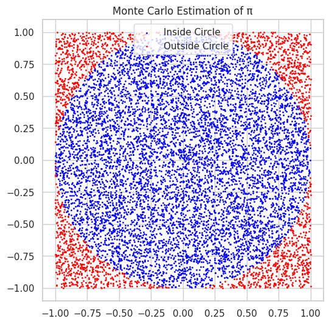
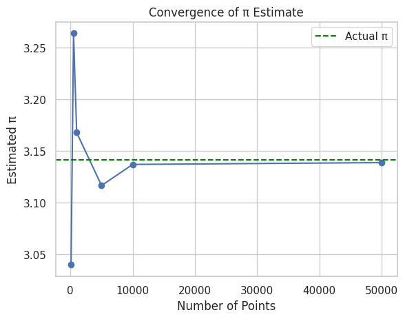
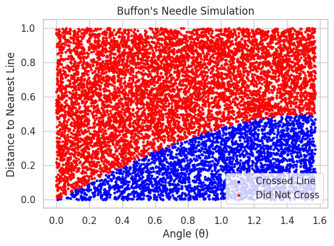

# Problem 2

# Estimating Pi using Monte Carlo Methods

## Motivation

Monte Carlo simulations are a class of computational algorithms that rely on repeated random sampling to obtain numerical results. One of the most intuitive applications of this method is **estimating the value of π** using geometric probability.

This project demonstrates two powerful Monte Carlo approaches:

1. Using random points inside a square that bounds a unit circle.

2. Simulating Buffon's Needle problem—a famous probability experiment.


## PART 1: Estimating π Using a Circle

### Theoretical Foundation

We consider a **unit circle** (radius = 1) inscribed in a square of side length 2 (centered at origin).

The **area** of:

- the circle $= π·r² = π (since r = 1)$

- the square $= (2·r)² = 4$

The ratio of their areas is:

$$
\frac{\text{Area of Circle}}{\text{Area of Square}} = \frac{\pi}{4}
$$

If we randomly generate points in the square, the probability that a point falls inside the circle is also $\frac{\pi}{4}$

Hence:

$$
\pi \approx 4 \cdot \frac{\text{Number of points inside the circle}}{\text{Total number of points}}
$$

### Python Simulation

```python
import numpy as np
import matplotlib.pyplot as plt

def estimate_pi_circle(num_points):
    x = np.random.uniform(-1, 1, num_points)
    y = np.random.uniform(-1, 1, num_points)
    inside_circle = x**2 + y**2 <= 1
    pi_estimate = 4 * np.sum(inside_circle) / num_points
    return pi_estimate, x, y, inside_circle

# Example
pi, x, y, inside = estimate_pi_circle(10000)
print("Estimated π:", pi)
```

```Estimated π: 3.1336```

### Visualization

```python
plt.figure(figsize=(6, 6))
plt.scatter(x[inside], y[inside], s=1, color='blue', label='Inside Circle')
plt.scatter(x[~inside], y[~inside], s=1, color='red', label='Outside Circle')
plt.gca().set_aspect('equal')
plt.title('Monte Carlo Estimation of π')
plt.legend()
plt.show()
```


### Convergence Analysis

You can observe convergence by plotting estimated $π$ values as a function of sample size:

```python
samples = [100, 500, 1000, 5000, 10000, 50000]
estimates = [estimate_pi_circle(n)[0] for n in samples]

plt.plot(samples, estimates, marker='o')
plt.axhline(np.pi, color='green', linestyle='--', label='Actual π')
plt.title('Convergence of π Estimate')
plt.xlabel('Number of Points')
plt.ylabel('Estimated π')
plt.legend()
plt.grid(True)
plt.show()
```


## PART 2: Estimating π Using Buffon’s Needle

### Theoretical Foundation

Buffon’s Needle problem involves dropping a needle of length $L$ onto a plane with parallel lines a distance $D$ apart (where $L \leq D$).

If $N$ needles are dropped and $H$ of them cross a line, then:

$$
\pi \approx \frac{2L \cdot N}{H \cdot D}
$$

This estimate depends on:

- Random needle center positions

- Random needle angles

### Python Simulation

```python
def estimate_pi_buffon(num_needles, L=1.0, D=2.0):
    if L > D:
        raise ValueError("Needle length must be <= distance between lines.")

    # Generate random angles and distances to nearest line
    theta = np.random.uniform(0, np.pi / 2, num_needles)
    y = np.random.uniform(0, D / 2, num_needles)

    crosses = y <= (L / 2) * np.sin(theta)
    num_crosses = np.sum(crosses)

    if num_crosses == 0:
        return None  # Avoid division by zero

    pi_estimate = (2 * L * num_needles) / (num_crosses * D)
    return pi_estimate, theta, y, crosses

# Example
pi_buffon, theta, y_vals, hits = estimate_pi_buffon(10000)
print("Estimated π using Buffon's Needle:", pi_buffon)
```
```Estimated π using Buffon's Needle: 3.244646333549643```

### Visualization

```python
plt.figure(figsize=(6, 4))
plt.scatter(theta[hits], y_vals[hits], color='blue', s=5, label='Crossed Line')
plt.scatter(theta[~hits], y_vals[~hits], color='red', s=5, label='Did Not Cross')
plt.title("Buffon's Needle Simulation")
plt.xlabel("Angle (θ)")
plt.ylabel("Distance to Nearest Line")
plt.legend()
plt.grid(True)
plt.show()
```


## Comparison and Analysis

| Method           | Estimate (10K samples) | Convergence Rate | Notes                        |
|------------------|------------------------|------------------|------------------------------|
| Circle-based     | ~3.14                  | Fast             | Simple geometry, fast to run |
| Buffon’s Needle  | ~3.14 (can vary more)  | Slower           | Sensitive to randomness      |


- Circle method converges more quickly and stably.

- Buffon’s method gives an elegant probabilistic interpretation of π.


## Deliverables

- **Markdown document** (this file) explaining the theory and showing code.

- **Python code** for both simulations.

- **Plots** for circle and needle simulations.

- **Analysis** showing convergence and comparing methods.


## Tools Used

- `NumPy` – random sampling and math

- `Matplotlib` – plotting

- `Jupyter Notebook` (recommended for running interactively)


## Conclusion

Monte Carlo methods provide a beautiful, visual, and practical way to understand π through randomness and geometry. While both methods are educational, the circle-based method is more computationally efficient and demonstrates fast convergence, whereas Buffon’s Needle showcases the elegance of probability theory in estimating a fundamental constant.
